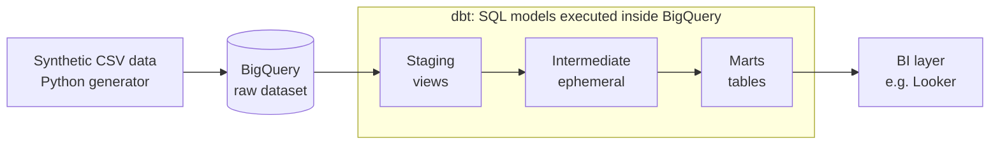

# Creator Analytics: dbt on BigQuery

An end-to-end analytics engineering project that turns raw, deliberately messy payment data from a fictional creator platform into a tested, documented daily revenue model. It covers the full lifecycle: cloud setup, data exploration, layered dbt modelling, data quality testing, and a CI/CD workflow from feature branch to production.

I built this project to gain hands-on experience with the modern GCP analytics stack and to practise the engineering habits around it: version control, pull requests, automated tests and safe deployments.

---

## Contents

1. [What the project answers](#what-the-project-answers)
2. [Architecture](#architecture)
3. [Tech stack](#tech-stack)
4. [Repository structure](#repository-structure)
5. [Data model](#data-model)
6. [Metric definition and assumptions](#metric-definition-and-assumptions)
7. [Data quality](#data-quality)
8. [Environments and deployment](#environments-and-deployment)
9. [How the project was built, stage by stage](#how-the-project-was-built-stage-by-stage)
10. [Problems encountered and how I solved them](#problems-encountered-and-how-i-solved-them)
11. [Design decisions and trade-offs](#design-decisions-and-trade-offs)
12. [Reproducing the project](#reproducing-the-project)
13. [Limitations and next steps](#limitations-and-next-steps)

---

## What the project answers

> **How much net revenue does each creator earn per day?**

The answer lives in a single, business-ready table, `fct_creator_daily_revenue`, with one row per creator per day. Supporting creator attributes are in `dim_creators`.

---

## Architecture



Data flows in one direction. Raw data is loaded untouched; dbt cleans it in staging, applies business logic in the intermediate layer, and exposes stable, tested tables in the marts layer. Only the marts are intended for downstream consumers.

---

## Tech stack

| Component | Role in the project |
| --- | --- |
| **Google BigQuery** | Storage and compute (sandbox mode, EU multi-region) |
| **dbt platform** (v2 engine) | Transformations, tests, documentation, scheduling, CI |
| **dbt_utils** | Additional generic tests |
| **GitHub** | Version control, pull requests, CI status checks |
| **Python** | Generating the synthetic raw data |

---

## Repository structure

```text
creator-analytics-example/
├── dbt_project.yml                      Project configuration, folder-level materializations, variables
├── packages.yml                         External packages (dbt_utils)
├── README.md
├── scripts/
│   └── generate_raw_data.py             Synthetic data generator (creators, payments, refunds)
├── models/
│   ├── staging/
│   │   ├── _sources.yml                 Raw source declarations and freshness rules
│   │   ├── _staging.yml                 Staging tests and documentation
│   │   ├── stg_payments.sql             Cleans, types and deduplicates payments
│   │   ├── stg_refunds.sql              Cleans and types refunds
│   │   └── stg_creators.sql             Cleans and standardises creator attributes
│   ├── intermediate/
│   │   └── int_payments_with_refunds.sql   Joins payments and refunds at payment grain
│   └── marts/
│       ├── _marts.yml                   Mart tests, unit test and documentation
│       ├── fct_creator_daily_revenue.sql   Daily revenue per creator
│       └── dim_creators.sql             One row per creator
└── tests/
    └── assert_refunds_do_not_exceed_gross.sql   Singular business-rule test
```

---

## Data model

### Lineage

```text
raw.payments ──► stg_payments ──┐
                                ├──► int_payments_with_refunds ──┬──► fct_creator_daily_revenue
raw.refunds  ──► stg_refunds  ──┘                                │
                                                                 └──► dim_creators
raw.creators ──► stg_creators ─────────────────────────────────────────► dim_creators
```

### Models and their grain

| Model | Layer | Materialization | Grain (one row per...) | Purpose |
| --- | --- | --- | --- | --- |
| `stg_payments` | Staging | View | Payment | Rename, cast, standardise status casing, deduplicate |
| `stg_refunds` | Staging | View | Refund | Rename, cast amounts to EUR |
| `stg_creators` | Staging | View | Creator | Standardise country codes and plan names |
| `int_payments_with_refunds` | Intermediate | Ephemeral | Successful payment | Attach refunds and platform fee without changing the grain |
| `fct_creator_daily_revenue` | Mart | Table, partitioned by `revenue_date`, clustered by `creator_id` | Creator per day | Daily gross, refunds, fees and net revenue |
| `dim_creators` | Mart | Table | Creator | Creator attributes plus first and last revenue date |

### Raw data

The generator produces about 50 days of data with intentional quality problems, so that every cleaning step in staging is justified by a real issue:

| Table | Rows | Injected problems |
| --- | --- | --- |
| `creators` | 200 | Inconsistent casing in country codes; plan values such as `Pro ` with a trailing space |
| `payments` | 20,196 | 196 exact duplicate rows (simulating at-least-once delivery); mixed-case statuses; amounts in cents; some rows loaded 30 hours late |
| `refunds` | 600 | Partial and full refunds; some refunds on failed payments |

---

## Metric definition and assumptions

**Net revenue** = successful payments − refunds on those payments − a 10% platform fee on gross, in EUR, assigned to calendar days in the Europe/Amsterdam time zone.

Several choices inside this definition are business decisions rather than technical ones. They are documented here so they can be challenged by stakeholders instead of being hidden in SQL:

| Decision | Current choice | Alternative a stakeholder might prefer |
| --- | --- | --- |
| Date a refund counts on | The original payment date | The refund date (past days would then stay fixed) |
| Time zone for daily boundaries | Europe/Amsterdam | UTC, or the creator's local time zone |
| Basis of the platform fee | 10% of gross, even if later refunded | 10% of net after refunds |
| Payments included | Status `succeeded` only | Also pending payments |
| Refunds on failed payments | Excluded, because their payment is filtered out | Flagged as a data quality issue for the source team |

The fee rate is defined once, as the variable `platform_fee_rate` in `dbt_project.yml`.

---

## Data quality

Every cleaning step in staging is paired with a test that proves it is needed, and every important assumption in the marts is enforced by a test.

| Test | Type | Model | Protects against |
| --- | --- | --- | --- |
| `unique`, `not_null` on `payment_id` | Generic | `stg_payments` | Duplicate deliveries reaching downstream models |
| `accepted_values` on `status` | Generic | `stg_payments` | New or mis-cased statuses silently dropping revenue |
| `unique`, `not_null` on `refund_id` | Generic | `stg_refunds` | Duplicate refunds |
| `accepted_values` on `plan` | Generic | `stg_creators` | Unstandardised plan names |
| `unique_combination_of_columns` (`creator_id`, `revenue_date`) | dbt_utils | `fct_creator_daily_revenue` | A broken grain, for example from join fanout |
| `expression_is_true` (`net_revenue_eur <= gross_eur`) | dbt_utils | `fct_creator_daily_revenue` | Violations of a basic business rule |
| `relationships` to `dim_creators` | Generic | `fct_creator_daily_revenue` | Revenue for creators that do not exist (foreign key check) |
| `unique`, `not_null` on `creator_id` | Generic | `dim_creators` | Fanout when BI tools join to the dimension |
| `assert_refunds_do_not_exceed_gross` | Singular | `int_payments_with_refunds` | Refunds larger than the payment they belong to |
| `net_revenue_subtracts_refunds_and_fees` | Unit | `fct_creator_daily_revenue` | Arithmetic errors in the revenue calculation |
| Source freshness on `payments._loaded_at` | Freshness | `raw.payments` | Ingestion silently stopping (warn after 24 h, error after 48 h) |

The singular test is used for the intermediate check because the intermediate model is ephemeral: it never exists as a BigQuery object, so generic tests cannot attach to it, while a singular test can still reference it.

---

## Environments and deployment

| Environment | Runs | Target datasets | Purpose |
| --- | --- | --- | --- |
| Development | My working branch, from the dbt Studio IDE | `dbt_<user>_staging`, `dbt_<user>_marts` | Building and testing changes in isolation |
| CI | Each pull request | `dbt_cloud_pr_...` (temporary) | Building and testing only modified models and their children |
| Production | `main` only | `analytics_staging`, `analytics_marts` | The trusted version, scheduled daily at 05:00 UTC |

### Workflow

```text
feature branch ──► commit and sync ──► pull request ──► CI job passes ──► merge to main ──► production job
```

- Work happens on feature branches named by intent, for example `feat/creator-revenue`. `main` is protected.
- The CI job uses Slim CI: it compares the pull request against the latest production run and builds only `state:modified+`, deferring unchanged parents to production.
- Production runs `dbt build` on `main`, so nothing reaches production without passing the same tests in CI first.

---

## How the project was built, stage by stage

### 1. Cloud foundation

I created a BigQuery project in sandbox mode and a `raw` dataset in the **EU** multi-region. I then created a dedicated service account for dbt with only the roles it needs: BigQuery Job User, BigQuery Data Editor and BigQuery Read Session User. A dedicated, least-privilege identity keeps dbt's access separate from my personal account.

### 2. Connecting dbt

I connected the dbt platform to BigQuery with the service account key, set the connection location to EU, linked the GitHub repository, and created a development environment.

### 3. Loading and exploring raw data

I generated the synthetic CSVs with Python and loaded them into `raw` as BigQuery load jobs. Before writing any model, I profiled the data with SQL: comparing total rows with distinct IDs, checking value distributions, looking for orphaned refunds and refunds on failed payments, and checking date ranges. I also checked the bytes each exploration query would scan before running it.

### 4. Staging layer

I declared the raw tables as sources, so models reference them through `source()` rather than hard-coded names, which gives lineage and freshness checks. Each staging model handles exactly one source: renaming columns to clear names, casting money to `NUMERIC`, standardising text values, converting timestamps to Amsterdam calendar dates, and deduplicating payments.

### 5. Intermediate layer

I combined payments and refunds into one row per successful payment. Refunds are aggregated per payment before the join, so a payment with several refunds cannot be duplicated.

### 6. Marts layer

I built the daily revenue fact table, partitioned by date and clustered by creator, and a creator dimension. Both are built from the same intermediate inputs rather than from each other.

### 7. Testing and documentation

I added generic, singular and unit tests, and documented each model's grain and the revenue definition in YAML, so the documentation lives next to the code.

### 8. CI/CD

I set up a production environment, a CI job triggered by pull requests, and a scheduled production job, and moved the project through the branch, pull request and merge workflow.

---

## Problems encountered and how I solved them

My general approach was the same each time: read the error literally, identify which layer it belongs to (permissions, configuration, region, code or data), fix it at the narrowest possible scope, verify, and where relevant turn the lesson into a test or documentation.

| # | Layer | Problem | Diagnosis | Solution |
| --- | --- | --- | --- | --- |
| 1 | Cloud permissions | Service account key creation was blocked | An organisation policy (`iam.disableServiceAccountKeyCreation`) was inherited from the organisation above the project | Granted myself Organisation Policy Administrator, separate from Organisation Administrator, and overrode the policy for this project only, keeping it enforced elsewhere |
| 2 | Tooling | The project could not be opened in Studio | No repository was attached and no development environment existed | Attached the GitHub repository and created a development environment |
| 3 | Permissions | The connection test failed on the BigQuery Storage API | dbt v2 reads results through the Storage Read API, which needs an extra role | Added BigQuery Read Session User to the service account, after confirming the API itself was enabled |
| 4 | Region | `Dataset raw was not found in location US` | The connection defaulted to the US while the data was in the EU | Set the connection location to EU |
| 5 | Region | `Dataset ... was not found in location EU` | The first failed run had already created the development dataset in the US; dataset names are unique per project regardless of region, so dbt reused it | Deleted the US dataset and recreated it in the EU |
| 6 | Code | `Source not found` | The source name in SQL did not match the name declared in YAML | Aligned the names, using snake_case to avoid hyphens in Jinja identifiers |
| 7 | Data | 20,196 rows instead of 20,000 | Total rows exceeded distinct payment IDs by 196; the duplicated IDs were identical copies, the signature of at-least-once delivery | Deduplicated in staging, keeping the latest loaded row per ID, and added a `unique` test |
| 8 | Packages | `dbt_utils is undefined` | The package was declared but not installed | Ran `dbt deps` |
| 9 | Tests | Syntax error in the singular test | dbt wraps test queries inside a larger query, so the test file must be a single clean `SELECT` | Corrected the test file |
| 10 | CI/CD | The first CI run was cancelled | Slim CI compares against the latest production run, and production had never run | Ran production once with `dbt compile` to create the comparison manifest, then reran CI |
| 11 | CI/CD | The first production `dbt build` failed | Production runs `main`, which still held dbt's starter models with a deliberately failing `not_null` test | Understood that production only reflects merged code; merged the reviewed changes before building production |

---

## Design decisions and trade-offs

- **`NUMERIC` for money, not `FLOAT64`.** Binary floating point cannot represent most decimals exactly, and small errors accumulate across millions of rows.
- **Deduplicate in staging, keep the latest row.** `row_number()` over `payment_id`, ordered by load time descending, keeps exactly one row per payment. `select distinct` would fail if copies differed in any column, and `rank()` would keep ties.
- **`TIMESTAMP` before converting to a date.** Only an absolute moment can be converted to an Amsterdam calendar date; a `DATETIME` has no time zone to convert from.
- **Aggregate before joining.** Refunds are summed per payment before the join, which keeps the intermediate grain at one row per payment and prevents fanout.
- **Ephemeral intermediate model.** It is a building block for marts, not a table for people to query, so it is not materialised in BigQuery.
- **Dimension independent of the fact.** `dim_creators` is built from staging and intermediate models, not from the fact table. This keeps lineage clean, means a failure in the revenue model cannot take the dimension down with it, and keeps the `relationships` test meaningful.
- **Partition and cluster only the mart.** The raw tables are a few megabytes, where partitioning adds overhead without saving cost. The fact table is what downstream tools query repeatedly, so it is partitioned by `revenue_date` and clustered by `creator_id`.
- **Least privilege throughout.** The service account has three narrow roles, and the key-creation policy was overridden for one project rather than the whole organisation.

---

## Reproducing the project

**Prerequisites:** a Google account, a dbt platform account and a GitHub account.

1. **BigQuery.** Create a project and a dataset named `raw` in the **EU** multi-region.
2. **Service account.** Create `dbt-runner` with BigQuery Job User, BigQuery Data Editor and BigQuery Read Session User, and download a JSON key. Never commit the key.
3. **Raw data.** Run `python scripts/generate_raw_data.py` and upload `creators.csv`, `payments.csv` and `refunds.csv` into `raw` with schema auto-detection.
4. **dbt connection.** Create a BigQuery connection from the JSON key, set **Location** to `EU`, and attach this repository.
5. **Build:**

```text
dbt deps                                        install packages
dbt build                                       build and test everything in dependency order
dbt build --select staging                      only the staging layer
dbt build --select +fct_creator_daily_revenue   the fact table and everything upstream
dbt source freshness                            check how recent the raw data is
dbt compile                                     render the SQL without running it
```

**Sandbox notes.** In BigQuery sandbox mode, tables and partitions expire after 60 days, and DML statements such as `MERGE` are not available. This is why the fact table is materialised as a full table rather than an incremental model, and why the generator only creates recent data.

---

## Limitations and next steps

- **Incremental fact table.** With billing enabled, convert `fct_creator_daily_revenue` to an incremental model with a merge strategy and a lookback window for late-arriving rows.
- **Snapshots.** Track changes in creator plans over time with a dbt snapshot (type 2 slowly changing dimension), so revenue can be analysed by the plan valid at payment time.
- **Freshness on static data.** The raw data does not grow, so the freshness check will start warning after a day. In a real pipeline, a scheduled ingestion job would keep it current.
- **Orchestration.** Move scheduling to Airflow when ingestion and transformation need to be coordinated as one pipeline.
- **Regression checks in CI.** Compare pull request builds against production with a package such as `audit_helper`, so unintended changes to revenue figures are visible before merge.
- **Keyless authentication.** Replace the service account key with Workload Identity Federation for CI.
- **Semantic layer.** Expose the marts in Looker through LookML views and explores.
